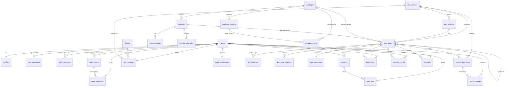

<p align="center">
  <!-- Ab - Logo - Light Mode -->
  <a href="https://abraham-ukachi.vercel.app/#gh-light-mode-only" target="_blank">
    
  </a>

  <!-- Ab - Logo - Dark Mode -->
  <a href="https://abraham-ukachi.vercel.app/#gh-dark-mode-only" target="_blank">
    
  </a>

  <!-- Next.js - Logo Name - Light Mode -->
  <a href="https://nextjs.org/#gh-light-mode-only" target="_blank">
    
  </a>

  <!-- Next.js - Logo Name - Dark Mode -->
  <a href="https://nextjs.org/#gh-dark-mode-only" target="_blank">
    
  </a>
</p>


<p align="center" style="width:512px; margin:0 auto;">
  <b>abElements</b> is the home of every <b>Ab</b> package: docs, live examples, and an installable PWA, built with the same packages it documents.
</p>

<p align="center" style="margin-top:12px;">
    <a href="https://ab-elements.vercel.app" target="_blank"><b>Checkout abElements &rarr;</b></a>
</p>


# `ab-elements-app`

> IMPORTANT: This is a work in progress and subject to major changes until version 1.0


## What is abElements? 🧩

Imagine a cozy little workshop 🛠️ where every shelf holds a beautifully labeled box 📦: **fonts** ✏️, **icons** ⭐️, **animations** 💫, **theme** 🎨, **hooks** 🪝, **core** layouts 🌱 and **components** 🧱. That workshop is **abElements**!

It's the **docs site + Progressive Web App** 📱💻 for [Abraham Ukachi](https://github.com/abraham-ukachi)'s `ab-nextjs-*` packages on npm. Browse the catalog 🗂️, read the docs 📖, poke at live previews 👀, flip between `pnpm`, `npm`, `yarn` and `bun` install snippets in one click 📋, and hit **`Ctrl/⌘ + K`** to find *anything* in a blink ⚡️.

Sign in with your **email + password**, a ✨ **magic link**, or **GitHub** 🐙 and abElements remembers your **theme** 🌗, **accent color** 🎨, **density**, **font size**, **reduced motion** 🧘 preference, favorite **package manager**, **bookmarks** 🔖 and **recently viewed** pages 🕘, on every device you sign in to.

And the best part? 🍒 abElements is **built with the very packages it documents** (we eat our own cooking 🍳😜). It's 100% free, always will be 🫶🏼, and it looks great in ☀️ light, 🌙 dark or whatever your 💻 system prefers.

> MOTTO: We'll always do [**more**](#more) 😜


## Guiding principle: packages first 📦➡️📱

`ab-elements-app` **must consume all seven Ab packages** (fonts, icons, animations, theme, hooks, core, components).
Whenever the app needs something that doesn't exist yet (e.g. a `Sheet`, a `BottomNav`, a `useAbMedia` hook), it is **built in the relevant package first**, released to npm, and **then** used in the app. No app-only copies of reusable UI. 🚫📋

The pieces the approved designs still need from the packages are tracked in [Package gaps](#package-gaps-to-build-first).


---


## Screens

Based on the approved UI/UX designs (light + dark, mobile, tablet, laptop and desktop mockups, kept in the private design workspace).

| No. | Screen | Route | What it does | Main Ab building blocks |
|:----|:-------|:------|:-------------|:------------------------|
| 1 | *`Splash`* | `@splash` (parallel route) | Centered AbElements logo + thin progress bar while the docs index loads. | `AbScreenLayout`, `AbLinearProgress` (core), logos (icons) |
| 2 | *`Welcome`* | `@welcome` (parallel route) | First-run onboarding: "Ship docs-ready UI with AbElements", tile collage, **Get Started** CTA, theme + language utilities. Mobile = bottom sheet card; laptop = split pane. | `AbScreenLayout`, `AbMainLayout`, `AbAsideLayout` (core), `AbButton`, `AbIconButton` |
| 3 | *`Home`* | `/` | Docs catalog: hero, install snippet with `pnpm / npm / yarn / bun` tabs, **Packages (7)** card grid with version badges, guides, "What's new" card. | `AbSidebar`, `AbNavbar`, `AbSearchbar`, `AbTabs`, `AbButton`, `AbBadge` |
| 4 | *`Docs / Package detail`* | `/docs/[[...slug]]` | Breadcrumbs, title + package/version/`client` chips, Installation, live **Preview / Code**, Usage, Props, Accessibility, **On This Page** aside, Edit this page / Report an issue / View source, Related. | `AbMainLayout` + `AbAsideLayout` (core), `AbDemoBox`, `AbDemoCode`, `AbTabs`, `AbCollapsible` |
| 5 | *`Login`* | `/login` | Sign in with **Password** or **Magic link** (segmented toggle), "Forgot password?", **Continue with GitHub**, link to register. | `AbInput`, `AbButton`, `AbIconButton` |
| 6 | *`Register`* | `/register` | Create account (name, email, password or magic link), Terms checkbox, **Continue with GitHub**. | `AbInput`, `AbButton` |
| 7 | *`Profile`* | `/profile` | Avatar + name + `@handle`, joined date, **Connected accounts** (GitHub, Email), **Bookmarked docs**, **Recently viewed**, Sign out. | `AbAvatar`, `AbButton`, `AbBadge` |
| 8 | *`Settings`* | `/settings` | **Appearance** (theme System/Light/Dark, accent color, density, font size), **Accessibility** (reduced motion, focus rings), **Docs preferences** (package manager, language), **Notifications** (What's new emails), **Account** (email, password, delete account). Synced to the account. | `AbButton`, `AbInput`, `useAbTheme` |
| 9 | *`404`* | `not-found.tsx` | Big "404", "Did you mean `/docs/components/button`?", search, **Back to home** / **Browse docs**, suggested + popular pages. | `AbSearchbar`, `AbButton` |
| 10 | *`Cmd/Ctrl + K`* | overlay (not a route) | Command palette: grouped results (Components, Props, Guides), filters, recent searches, keyboard hints. On mobile it opens from the **Search** tab as a full screen. | `AbSearchbar`, `AbSearchResult`, `useAbDialog` |

> NOTE: The mockups are private drafts and are intentionally **not** linked here.


### Responsive PWA shell 📐

| Breakpoint | Layout |
|:-----------|:-------|
| 📱 **Mobile** | Bottom bar (**Home · Docs · Search · Profile**) + main. Sidebar and aside hidden by default; the aside opens at 100% width. **Search** opens the `Ctrl/⌘ + K` overlay. |
| 📲 **Tablet** | Sidebar + main, no bottom bar. The aside ("On this page") is fixed right, hidden by default, and toggled from the app bar (`<<` / `>>`) at ~30-40% width. |
| 💻 **Laptop** | Sidebar + main + aside **joined**: no gaps, no rounded corners, faint dividers. |
| 🖥️ **Desktop** | Sidebar + main + aside as **gapped panes** with rounded corners and no dividers. |

- 🧭 The left sidebar collapses to an icon rail (`<<` / `>>`); collapsed icons show a balloon tooltip with a pop animation (`ab-nextjs-animations`). Selected items go outlined → filled, with no background chip.
- 🌗 Theme follows the **system** by default, with explicit **light** / **dark** in the app bar and in Settings.
- 📦 Installable PWA (manifest + icons in [`public/`](./public/)), standalone display, light/dark favicons.


---


## Tech stack & versions 🧰

Versions as declared in [`package.json`](./package.json) (2026-10-03):

| Tool | Version | Notes |
|:-----|:--------|:------|
| [Next.js](https://nextjs.org/docs) | **16.3.4** | App Router, Turbopack by default, ESLint CLI (no `next lint`). Pinned to match the Ab packages' `next` peer. |
| [React](https://react.dev) / React DOM | **19.3.0** | |
| [Tailwind CSS](https://tailwindcss.com) + `@tailwindcss/postcss` | **^4.3.3** | CSS-first config (`@import "tailwindcss"` in [`app/globals.css`](./app/globals.css)). |
| [TypeScript](https://www.typescriptlang.org) | **^6.0.3** | |
| [ESLint](https://eslint.org) + `eslint-config-next` | **^9.39.5** + **16.3.4** | Flat config in [`eslint.config.mjs`](./eslint.config.mjs). |
| `@types/node` / `@types/react` / `@types/react-dom` | ^26.6.4 / ^19.3.0 / ^19.3.0 | |
| `clsx` | ^2.1.1 | Peer of `ab-nextjs-core` / `ab-nextjs-components`. |
| Node.js | **>= 20.9** | Minimum required by Next.js 16. |
| Package manager | **pnpm 11** | Settings live in [`pnpm-workspace.yaml`](./pnpm-workspace.yaml). |
| Database (planned) | **MySQL 8**-compatible on Vercel | See [Database](#database). |


## The Ab packages

All seven are installed as dependencies of this app:

```sh
pnpm add ab-nextjs-fonts ab-nextjs-icons ab-nextjs-animations ab-nextjs-theme ab-nextjs-hooks ab-nextjs-core ab-nextjs-components
```

| No. | Package | Version | Role in abElements | Entry file | Status |
|:----|:--------|:--------|:-------------------|:-----------|:-------|
| 1 | ✏️ [`ab-nextjs-fonts`](https://github.com/abraham-ukachi/ab-nextjs-fonts) | ^0.2.4 | All app typefaces (Inter, Mulish, Quicksand, Roboto, Zilla Slab) instead of `next/font/google`. | [index.ts](https://github.com/abraham-ukachi/ab-nextjs-fonts/blob/main/index.ts) | Done |
| 2 | ⭐️ [`ab-nextjs-icons`](https://github.com/abraham-ukachi/ab-nextjs-icons) | ^0.1.5 | Sidebar, bottom bar, card and action icons; Ab / AbElements logos. | [src/index.ts](https://github.com/abraham-ukachi/ab-nextjs-icons/blob/main/src/index.ts) | Done |
| 3 | 💫 [`ab-nextjs-animations`](https://github.com/abraham-ukachi/ab-nextjs-animations) | ^0.2.2 | Balloon pop, sheet/aside slides, fades; turned off by **reduced motion**. | [index.ts](https://github.com/abraham-ukachi/ab-nextjs-animations/blob/main/index.ts) | Done |
| 4 | 🎨 [`ab-nextjs-theme`](https://github.com/abraham-ukachi/ab-nextjs-theme) | ^0.2.10 | Color tokens (light / dark + medium & high contrast), typography, CSS variables; accent color + density. | [styles.css](https://github.com/abraham-ukachi/ab-nextjs-theme/blob/main/styles.css) | Done |
| 5 | 🪝 [`ab-nextjs-hooks`](https://github.com/abraham-ukachi/ab-nextjs-hooks) | ^0.1.3 | Theme, dialogs (Cmd/Ctrl+K), menus, toasts, toggles, auth/user helpers. | [index.ts](https://github.com/abraham-ukachi/ab-nextjs-hooks/blob/main/index.ts) | Done |
| 6 | 🌱 [`ab-nextjs-core`](https://github.com/abraham-ukachi/ab-nextjs-core) | ^0.1.3 | App / Screen / Main / Aside layouts (server + client), page provider, linear progress. | [index.ts](https://github.com/abraham-ukachi/ab-nextjs-core/blob/main/index.ts) | Done |
| 7 | 🧱 [`ab-nextjs-components`](https://github.com/abraham-ukachi/ab-nextjs-components) | ^0.1.5 | Sidebar, navbar, searchbar, buttons, inputs, tabs, avatar, badge, balloon, demo box/code... | [index.ts](https://github.com/abraham-ukachi/ab-nextjs-components/blob/main/index.ts) | Done |
| 8 | 🌍 `ab-nextjs-i18n` | - | Locales + messages for the **Language** setting (en, fr, es, ru), replacing the old `next-intl` + `ab_translator.mjs` plan. | *to be created* | Pending |


### Package gaps (to build first)

What the approved designs use that the packages don't ship yet. Each one gets built **in its package first**, then used here.

| Needed by | Package | Missing piece | Status |
|:----------|:--------|:--------------|:-------|
| Home, Docs | `ab-nextjs-components` | `AbCard` (package / suggestion cards) | Pending |
| Docs | `ab-nextjs-components` | `AbChip` (package, version, `client` / `server` chips) | Pending |
| Docs, Mobile | `ab-nextjs-components` | `AbSheet` (aside at 100% width, mobile bottom sheet) | Pending |
| Mobile | `ab-nextjs-components` | `AbBottomNav` (Home · Docs · Search · Profile) | Pending |
| Cmd/Ctrl+K | `ab-nextjs-components` | `AbDialog` / `AbCommandPalette` (+ `AbKbd`) | Pending |
| Settings, Login | `ab-nextjs-components` | `AbSwitch`, `AbSegmentedControl`, `AbCheckbox`, `AbRadioCard`, `AbSelect` | Pending |
| Docs | `ab-nextjs-components` | `AbCodeBlock` (package-manager tabs + copy), `AbBreadcrumbs`, `AbToc` (On This Page), `AbPropsTable` | Pending |
| Shell | `ab-nextjs-hooks` | `useAbMedia` / breakpoints, `useAbHotkey` (Cmd/Ctrl+K), `useAbScrollSpy` (TOC), `useAbClipboard` | Pending |
| Settings | `ab-nextjs-i18n` | Locale routing + messages (en, fr, es, ru) | Pending |

> NOTE: Some names above are proposals; final names follow each package's own catalog.


---


## Getting Started 🚀

```bash
pnpm install
pnpm dev
```

Open [http://localhost:3000](http://localhost:3000) with your browser to see the result.

| Script | Command |
|:-------|:--------|
| `pnpm dev` | `next dev` (Turbopack) |
| `pnpm build` | `next build` |
| `pnpm start` | `next start` |
| `pnpm lint` | `eslint .` |

Environment variables (planned, for auth + database; never commit them):

| Variable | Used for |
|:---------|:---------|
| `DATABASE_URL` | MySQL-compatible connection string (injected by the Vercel integration). |
| `AUTH_SECRET` | Signing / encrypting session cookies and OAuth tokens. |
| `GITHUB_CLIENT_ID` / `GITHUB_CLIENT_SECRET` | "Continue with GitHub" OAuth app. |
| `EMAIL_PROVIDER_API_KEY` / `EMAIL_FROM` | Magic links, password resets, "What's new" digest. |
| `NEXT_PUBLIC_APP_URL` | `https://ab-elements.vercel.app` in production. |


## Structure 🗂️
> IMPORTANT: `ab-elements-app` uses the [App Router](https://nextjs.org/docs/app) of [Next.js](https://nextjs.org/) 16.

### Current

```sh
.
├── app
│   ├── globals.css          # Tailwind v4 + ab-nextjs-theme styles.css + ab-nextjs-fonts Inter
│   ├── layout.tsx           # no-flash theme script, lang from APP_LANG
│   ├── manifest.ts          # web app manifest (/manifest.webmanifest)
│   ├── metadata.ts
│   ├── not-found.tsx        # simple 404 (full design still pending)
│   ├── page.tsx             # Coming Soon page
│   └── viewport.ts
├── public                   # logos, favicons, PWA icons, screenshots
├── eslint.config.mjs
├── next.config.ts
├── package.json
├── pnpm-workspace.yaml
├── postcss.config.mjs
└── tsconfig.json
```

### Planned (draft, follows the approved designs)

```sh
.
├── app
│   ├── layout.tsx               # <html>, fonts, theme bootstrap, AbAppLayout
│   ├── globals.css              # tailwindcss + ab-nextjs-theme + ab-nextjs-animations
│   ├── @splash/                 # Splash screen (page.tsx + default.tsx)
│   ├── @welcome/                # Welcome / onboarding (page.tsx + default.tsx)
│   ├── (docs)/                  # shell: sidebar + app bar + bottom bar + aside
│   │   ├── layout.tsx
│   │   ├── page.tsx             # Home
│   │   ├── docs/[[...slug]]/    # Docs / package / element detail + On This Page
│   │   ├── changelog/
│   │   └── (account)/           # profile/, bookmarks/, settings/ (signed in)
│   ├── (auth)/                  # login/, register/ (split-pane auth layout)
│   ├── auth/                    # route handlers: GitHub callback, magic-link verify, sign-out
│   └── not-found.tsx            # 404 design
├── database
│   ├── README.md                # provider notes + how to apply
│   └── schema.sql               # MySQL 8 DDL (see below)
├── proxy.ts                     # Next.js 16 "proxy" (formerly middleware): session + auth guards
└── public
```

> NOTE: The old `demo` and `search` pages are gone from the plan: search is the `Ctrl/⌘ + K` overlay, and there is no demo screen in the designs. The old `components/`, `core/` and `hooks/` folders are replaced by the npm packages.


---


## Database

A MySQL 8 schema for accounts, auth, synced settings, the docs catalogue, search, bookmarks and history.
DDL: [`database/schema.sql`](./database/schema.sql) (29 tables, 41 foreign keys, utf8mb4 / InnoDB). Not created anywhere yet: it will be created on Vercel later.

### Where it will live (Vercel) ☁️

Vercel has no first-party MySQL product: databases come from the [Vercel Marketplace](https://vercel.com/marketplace/category/database), where the native storage options are mostly Postgres / Redis (Neon, Supabase, Prisma Postgres, AWS Aurora PostgreSQL / DSQL, Upstash...). MySQL-compatible options are connect-style integrations:

| Provider | Vercel integration | Free tier | Serverless driver | Foreign keys | Verdict |
|:---------|:-------------------|:----------|:------------------|:-------------|:--------|
| **[TiDB Cloud](https://vercel.com/marketplace/tidb-cloud) Starter** | Marketplace integration, injects `DATABASE_URL` / `TIDB_*` env vars | ✅ up to 5 free instances (5 GiB row storage + 50M RUs / month each) | ✅ `@tidbcloud/serverless` over HTTP | ✅ enforced (GA since TiDB v8.5) | ⭐️ **Recommended** |
| **[PlanetScale](https://planetscale.com/docs/vitess/tutorials/deployments/deploy-to-vercel)** (Vitess) | Marketplace integration (connect an existing DB) | ❌ (Vitess clusters start at a paid tier) | ✅ `@planetscale/database` | ✅ unsharded DBs, opt-in "Allow foreign key constraints" (GA Feb 2024) | 👍 Solid paid alternative |
| AWS via Vercel Marketplace | Native | $100 credits | - | - | ❌ Offers Aurora **PostgreSQL** / DSQL / DynamoDB, **not MySQL** |

**Why TiDB Cloud Starter:** free to start, MySQL 8 wire-compatible, an HTTP serverless driver for Vercel Functions, enforced foreign keys (the `ON DELETE` rules below actually run), and database branching for preview deployments.
The schema was test-applied on **MySQL 8.4.6** and **TiDB v8.5.8** (all 29 tables + 41 FKs). On TiDB, `CHECK` constraints are ignored unless `tidb_enable_check_constraint` is on, so the app validates those values too.

### ER diagram



### Tables

#### 1. Identity & auth 🔐

| Table | Purpose | Key columns | Relations | Powers |
|:------|:--------|:------------|:----------|:-------|
| `users` | One row per person. | `public_id` (ULID), `email` (unique, case-insensitive), `email_verified_at`, `username`, `role`, `status`, `terms_accepted_at`, `last_sign_in_at`, `deleted_at` | Parent of every user-owned table | Register, Login, Profile ("Joined Sep 2026"), Settings > Account |
| `profiles` | Display info. | `display_name`, `initials`, `avatar_url`, `avatar_source`, `bio`, `website_url`, `timezone` | 1:1 `users` (CASCADE) | Profile header, avatar in app bar |
| `user_passwords` | Email + password credential (optional). | `password_hash` (argon2id), `password_changed_at`, `failed_attempts`, `locked_until` | 1:1 `users` (CASCADE) | Login (Password tab), Settings > "Change password / Last changed 3 months ago" |
| `oauth_accounts` | Linked identity providers. | `provider` ('github'), `provider_account_id`, `provider_username`, encrypted tokens, `scope` | N:1 `users` (CASCADE); unique (`provider`, `provider_account_id`) | "Continue with GitHub", Profile > Connected accounts |
| `sessions` | Server-side sessions (the cookie holds an opaque token; only its SHA-256 is stored). | `token_hash`, `auth_method`, `ip_address`, `user_agent`, `device_label`, `expires_at`, `revoked_at` | N:1 `users` (CASCADE) | Staying signed in, "Signed in with GitHub", Sign out |
| `auth_tokens` | Single-use, short-lived tokens. | `purpose` (magic sign-in / sign-up, email verification, password reset, email change), `token_hash`, `email`, `payload` (JSON), `expires_at` (15 min for magic links), `consumed_at` | N:1 `users` (CASCADE, NULL for sign-up links) | Magic link (Login + Register), Forgot password, email verification, change email |

#### 2. Settings & preferences ⚙️

| Table | Purpose | Key columns | Relations | Powers |
|:------|:--------|:------------|:----------|:-------|
| `user_settings` | Synced appearance + docs preferences. | `theme` (system / light / dark), `accent_color`, `density` (compact / comfortable), `font_size_px` (14 / 15 / 16 / 18), `reduced_motion` (NULL = follow OS), `always_show_focus_rings`, `package_manager` (pnpm / npm / yarn / bun), `locale_code`, `docs_version_id`, `sidebar_collapsed`, `settings_version` | 1:1 `users` (CASCADE); N:1 `locales`; N:1 `doc_versions` (SET NULL) | Settings > Appearance, Accessibility, Docs preferences; theme toggle in the app bar; install snippets; "Saved to your account" |
| `email_preferences` | Mail opt-ins. | `whats_new_digest`, `digest_frequency`, `product_announcements`, `security_alerts`, `unsubscribe_token_hash` | 1:1 `users` (CASCADE) | Settings > Notifications ("What's new emails"), one-click unsubscribe |
| `locales` | Languages the UI offers. | `code` (BCP-47), `english_name`, `native_name`, `is_enabled` | Referenced by `user_settings` | Settings > Language, Welcome globe button (`ab-nextjs-i18n`) |

#### 3. Catalogue 📦

| Table | Purpose | Key columns | Relations | Powers |
|:------|:--------|:------------|:----------|:-------|
| `packages` | The npm packages (7 + `ab-nextjs-i18n` planned). | `slug`, `npm_name`, `display_name`, `framework`, `tagline`, `icon_name`, `github_repo`, `status` (planned / pending / beta / stable / deprecated), `latest_version` | Parent of `package_versions`, `elements`, `doc_pages` | Home "Packages (7)" grid, sidebar Packages list, version badges, "beta" tag |
| `package_versions` | Releases. | `version`, `release_line` ('v1.x'), `channel`, `is_latest`, `changelog_md`, `next_peer_range`, `released_at` | N:1 `packages` (RESTRICT) | Changelog, What's new, version badges, compatibility notes |
| `elements` | Everything a package exports. | `export_name` ('AbButton', 'useAbTheme', 'popIn'), `kind` (component / layout / hook / icon / animation / font / theme_token...), `rendering` (client / server / universal), `import_path`, `source_path`, `status` | N:1 `packages` (CASCADE) | Docs element pages, `client` / `server` chip, "Source" link, Cmd+K Components group |
| `element_props` | Props reference. | `name`, `type_signature`, `default_value`, `is_required`, `description` | N:1 `elements` (CASCADE) | Docs > Props table, Cmd+K "PROPS" group |
| `element_examples` | Code + live preview examples. | `slug`, `title`, `filename` ('toolbar.tsx'), `language`, `code`, `preview_key` | N:1 `elements` (CASCADE) | Docs > Preview / Code tabs, Usage snippets |

#### 4. Docs content 📖

| Table | Purpose | Key columns | Relations | Powers |
|:------|:--------|:------------|:----------|:-------|
| `doc_versions` | Docs versions. | `label` ('v1.x'), `slug`, `status`, `is_default` | Parent of sections / pages / search docs | "Docs v1.x" switcher |
| `doc_sections` | Sidebar groups. | `slug`, `title`, `requires_auth`, `sort_order` | N:1 `doc_versions` (CASCADE) | Sidebar: Getting started, Packages, Guides, Account |
| `doc_pages` | Index of every docs page (content stays in MDX). | `path` ('/docs/components/button'), `kind`, `title`, `description`, `mdx_source_path`, `content_hash`, `edit_url`, `source_url`, `parent_id` | N:1 `doc_versions`, `doc_sections`, `packages`, `elements`; self-reference for nesting | Docs pages, breadcrumbs, nested sidebar, "Edit this page" / "View source" |
| `doc_headings` | Table of contents. | `anchor`, `text`, `level`, `parent_id` | N:1 `doc_pages` (CASCADE); self-reference | "On this page" aside, deep-link search hits |
| `doc_page_relations` | Related pages. | (`page_id`, `related_page_id`), `sort_order` | N:M `doc_pages` | Docs aside "Related" card |
| `doc_page_stats` | Aggregated counters. | `views_total`, `views_7d`, `views_30d`, `bookmarks_count`, `helpful_yes/no` | 1:1 `doc_pages` (CASCADE) | 404 "Popular pages", ranking |
| `redirects` | Moved docs + 404 suggestions. | `from_path` (unique), `to_path`, `status_code`, `is_suggestion`, `hits` | - | 404 "Did you mean ...?", permanent redirects |

#### 5. Search, bookmarks & history 🔎

| Table | Purpose | Key columns | Relations | Powers |
|:------|:--------|:------------|:----------|:-------|
| `search_documents` | Denormalised search index, rebuilt on deploy. | `entity_type` (package / element / prop / page / heading / guide), `entity_id`, `title`, `breadcrumb`, `url`, `keywords`, `excerpt`, `weight` | N:1 `doc_versions`, `doc_pages` (CASCADE) | Cmd/Ctrl+K results + group counts, 404 search |
| `search_queries` | Search history. | `query`, `scope`, `source` (cmdk / searchbar / not_found), `results_count`, `selected_url`, `anon_id`, `cleared_at` | N:1 `users` (CASCADE, NULL when signed out); N:1 `search_documents` (SET NULL) | Cmd+K "Recent searches" + Clear, search analytics |
| `bookmarks` | Favorites. | (`user_id`, `page_id`), `note`, `created_at` | N:M `users` x `doc_pages` (CASCADE) | Profile "Bookmarked docs", "All bookmarks", bookmark icon |
| `recently_viewed` | Per-user history (upsert). | (`user_id`, `page_id`), `view_count`, `last_viewed_at` | N:M `users` x `doc_pages` (CASCADE) | Profile "Recently viewed" ("2h ago", "Yesterday") + Clear |

#### 6. Communication, feedback & audit 📣

| Table | Purpose | Key columns | Relations | Powers |
|:------|:--------|:------------|:----------|:-------|
| `announcements` | Release highlights. | `badge` ('New'), `title`, `body`, `url`, `starts_at`, `ends_at`, `include_in_digest` | N:1 `packages`, `package_versions`, `users` (SET NULL) | Home "New: BottomNav & Sheet" card, Changelog, digest content |
| `email_deliveries` | Outbound mail log (no bodies). | `template`, `to_email`, `provider_message_id`, `status`, `sent_at` | N:1 `users`, `auth_tokens` (SET NULL) | Debugging magic links / resets, digest delivery |
| `feedback` | User reports. | `kind` (broken_link / issue / helpful / not_helpful / suggestion), `path`, `message`, `github_issue_url`, `status` | N:1 `users`, `doc_pages` (SET NULL) | "Report an issue", "Report a broken link" (404) |
| `audit_logs` | Security + account trail. | `event` ('auth.sign_in', 'account.deleted', ...), `ip_address`, `user_agent`, `metadata` | N:1 `users`, `sessions` (SET NULL) | Security review, "new sign-in" alerts, account deletion record |

> Security notes: passwords are argon2id hashes, all emailed/session tokens are stored as SHA-256 digests, OAuth tokens are encrypted by the app before insert, and nothing secret goes into `audit_logs.metadata`.


---


## Jobs
> MOTTO: I'll always do [**more**](#more) 😜

Jobs related to this `ab-elements-app` project - a list of some specific files to be submitted as well as their corresponding / current **status** for this project:

| No. | Name | File | Status |
|:----|:-----|:-----|:-------|
| 1 | *`Splash - Screen`* | **app/@splash/page.tsx** | Pending |
| 2 | *`Welcome - Screen`* | **app/@welcome/page.tsx** | Pending |
| 3 | *`Home - Page`* | **app/(docs)/page.tsx** | Pending |
| 4 | *`Docs - Page`* | **app/(docs)/docs/[[...slug]]/page.tsx** | Pending |
| 5 | *`Login - Page`* | **app/(auth)/login/page.tsx** | Pending |
| 6 | *`Register - Page`* | **app/(auth)/register/page.tsx** | Pending |
| 7 | *`Profile - Page`* | **app/(docs)/(account)/profile/page.tsx** | Pending |
| 8 | *`Settings - Page`* | **app/(docs)/(account)/settings/page.tsx** | Pending |
| 9 | *`Not Found - Page`* | **app/not-found.tsx** | Pending |
| 10 | *`Command Palette - Overlay`* | **Cmd/Ctrl + K** (built in `ab-nextjs-components` first) | Pending |
| 11 | *`Docs - Layout`* | **app/(docs)/layout.tsx** | Pending |
| 12 | *`Auth - Layout`* | **app/(auth)/layout.tsx** | Pending |
| 13 | *`Root / App - Layout`* | [app/layout.tsx](./app/layout.tsx) | Done\* |
| 14 | *`Root / App - Styles`* | [app/globals.css](./app/globals.css) | Done\* |
| 15 | *`Proxy (auth guard)`* | **proxy.ts** | Pending |
| 16 | *`Database - Schema`* | [database/schema.sql](./database/schema.sql) | Done |
| 17 | *`Colors - Theme`* | [css/colors.css](https://github.com/abraham-ukachi/ab-nextjs-theme/blob/main/css/colors.css) | Done |
| 18 | *`Styles - Theme`* | [css/styles.css](https://github.com/abraham-ukachi/ab-nextjs-theme/blob/main/css/styles.css) | Done |
| 19 | *`Colors - Theme Module`* | [colors.js](https://github.com/abraham-ukachi/ab-nextjs-theme/blob/main/colors.js) | Done |
| 20 | *`Typography - Theme`* | [css/typography.css](https://github.com/abraham-ukachi/ab-nextjs-theme/blob/main/css/typography.css) | Done |
| 21 | *`App - Layout (server)`* | [server/ab-app-layout/index.tsx](https://github.com/abraham-ukachi/ab-nextjs-core/blob/main/server/ab-app-layout/index.tsx) | Done |
| 22 | *`Screen - Layout (server)`* | [server/ab-screen-layout/index.tsx](https://github.com/abraham-ukachi/ab-nextjs-core/blob/main/server/ab-screen-layout/index.tsx) | Done |
| 23 | *`Main - Layout (server)`* | [server/ab-main-layout/index.tsx](https://github.com/abraham-ukachi/ab-nextjs-core/blob/main/server/ab-main-layout/index.tsx) | Done |
| 24 | *`Aside - Layout (client)`* | [ab-aside-layout/index.tsx](https://github.com/abraham-ukachi/ab-nextjs-core/blob/main/ab-aside-layout/index.tsx) | Done |
| 25 | *`Page - Provider`* | [ab-page-provider/index.tsx](https://github.com/abraham-ukachi/ab-nextjs-core/blob/main/ab-page-provider/index.tsx) | Done |
| 26 | *`Theme - Hook`* | [useAbTheme.ts](https://github.com/abraham-ukachi/ab-nextjs-hooks/blob/main/useAbTheme.ts) | Done |
| 27 | *`Dialog - Hook`* | [useAbDialog.ts](https://github.com/abraham-ukachi/ab-nextjs-hooks/blob/main/useAbDialog.ts) | Done |
| 28 | *`useElement - Hook`* | **useAbElement.ts** (to be created in `ab-nextjs-hooks`) | Pending |
| 29 | *`Element - Provider`* | **ab-element-provider** (to be created in `ab-nextjs-core`) | Pending |

> WARNING: This list is a work in progress and will change soon

> NOTE: (\*) = still needs to be updated <br>
>       (TBD) = to be determined ;) <br>
>       Links to `ab-nextjs-*` files point to the `main` branch of each package on GitHub.


## More

These are some of the things we did or plan to do, in addition to this project's [screens](#screens). The animations now live in [`ab-nextjs-animations`](https://github.com/abraham-ukachi/ab-nextjs-animations):

| No. | Name | File | Status |
|:----|:-----|:-----|:-------|
| 1 | *`Pop In - Animation`* | [pop-in/styles.css](https://github.com/abraham-ukachi/ab-nextjs-animations/blob/main/pop-in/styles.css) | Done |
| 2 | *`Fade In - Animation`* | [fade-in/styles.css](https://github.com/abraham-ukachi/ab-nextjs-animations/blob/main/fade-in/styles.css) | Done |
| 3 | *`Slide From Down - Animation`* | [slide-from-down/styles.css](https://github.com/abraham-ukachi/ab-nextjs-animations/blob/main/slide-from-down/styles.css) | Done |
| 4 | *`Slide From Up - Animation`* | [slide-from-up/styles.css](https://github.com/abraham-ukachi/ab-nextjs-animations/blob/main/slide-from-up/styles.css) | Done |
| 5 | *`Slide Left - Animation`* | [slide-left/styles.css](https://github.com/abraham-ukachi/ab-nextjs-animations/blob/main/slide-left/styles.css) | Done |
| 6 | *`Slide From Left - Animation`* | [slide-from-left/styles.css](https://github.com/abraham-ukachi/ab-nextjs-animations/blob/main/slide-from-left/styles.css) | Done |
| 7 | *`Slide Right - Animation`* | [slide-right/styles.css](https://github.com/abraham-ukachi/ab-nextjs-animations/blob/main/slide-right/styles.css) | Done |
| 8 | *`Slide From Right - Animation`* | [slide-from-right/styles.css](https://github.com/abraham-ukachi/ab-nextjs-animations/blob/main/slide-from-right/styles.css) | Done |
| 9 | *`Web App Manifest - File`* | [app/manifest.ts](./app/manifest.ts) | Done\* |
| 10 | *`Package - JSON File`* | [package.json](./package.json) | Done\* |
| 11 | *`Fade Out - Animation`* | [fade-out/styles.css](https://github.com/abraham-ukachi/ab-nextjs-animations/blob/main/fade-out/styles.css) | Done |
| 12 | *`Slide Down - Animation`* | [slide-down/styles.css](https://github.com/abraham-ukachi/ab-nextjs-animations/blob/main/slide-down/styles.css) | Done |
| 13 | *`Slide Up - Animation`* | [slide-up/styles.css](https://github.com/abraham-ukachi/ab-nextjs-animations/blob/main/slide-up/styles.css) | Done |
| 14 | *`AB Translator - Script`* | **ab_translator.mjs** (moves to `ab-nextjs-i18n`) | Pending |
| 15 | *`Loop - Animation`* | [loop/styles.css](https://github.com/abraham-ukachi/ab-nextjs-animations/blob/main/loop/styles.css) | Done |
| 16 | *`Animations - Tailwind Plugin`* | [index.ts](https://github.com/abraham-ukachi/ab-nextjs-animations/blob/main/index.ts) | Done |
| 19 | *`AB Theme - Stylesheet`* | [styles.css](https://github.com/abraham-ukachi/ab-nextjs-theme/blob/main/styles.css) | Done |

> NOTE: (\*) = still needs to be updated. <br>
> There's certainly a couple of file we must've forgot or not added yet, so we'll keep the above list updated obv. :)


---

## Testing
> IMPORTANT: All the tests are performed end-to-end reliably using [playwright](https://playwright.dev/)

| Browser | Version | Status | Date | Time
|:--------|:--------|:-------|:-----|:-----
| *`Arc`* | **-** | *Pending* | - | -
| *`Brave`* | **-** | *Pending*  | - | -
| *`Chrome`* | **-** | *Pending* | - | -
| *`Firefox`* | **-** | *Pending* | - | -
| *`Safari`* | **-** | *Pending* | - | -
| *`Opera`* | **-** | *Pending* | - | -
| *`Edge`* | **-** | *Pending* | - | -
| *`IE`* | **-** | *Pending* | - | -

> NOTE: *`IE`* = Internet Explorer = 👎🏽


## Internationalization 🌍
> IMPORTANT: Translations will come from the upcoming [`ab-nextjs-i18n`](#the-ab-packages) package (Pending).

abElements will ship in at least 4 languages: **en**, **fr**, **ru** and **es** (see Settings > Docs preferences > Language).
The old `ab_translator.mjs` script (which used [translate-shell](https://github.com/soimort/translate-shell) to translate `messages/*.json`) is planned to move into `ab-nextjs-i18n`:

```sh
node ab_translator.mjs messages fr
```

> NOTE: The source file (e.g. `fr.json`) should be updated afterwards to fix typos and/or adapt the texts accordingly.


## TODOs

- [x] Create the project-specific logos
- [x] Design the screens (splash, welcome, home, docs, login, register, profile, settings, 404, Cmd/Ctrl+K)
- [x] Design the database schema ([`database/schema.sql`](./database/schema.sql))
- [ ] Build the [package gaps](#package-gaps-to-build-first) in their packages, then use them here
- [ ] Add localization / internationalization (at least: **en**, **fr**, **ru** and **es**) via `ab-nextjs-i18n`
- [ ] Create the database on Vercel (TiDB Cloud Starter recommended)

### Next.JS - TODOs
- [x] 🌱 Create a `ab-nextjs-core` **npm** package
- [x] 💫 Create a `ab-nextjs-animations` **npm** package
- [x] 🎨 Create a `ab-nextjs-theme` **npm** package
- [x] 📦 Create a `ab-nextjs-components` **npm** package
- [x] ✏️  Create a `ab-nextjs-fonts` **npm** package
- [x] ⭐️ Create a `ab-nextjs-icons` **npm** package
- [x] 🪝 Create a `ab-nextjs-hooks` **npm** package
- [ ] 🌍 Create a `ab-nextjs-i18n` **npm** package (Pending)

### React - TODOs
- [ ] 🌱 Create a `ab-react-core` **npm** package
- [ ] 💫 Create a `ab-react-animations` **npm** package
- [ ] 🎨 Create a `ab-react-theme` **npm** package
- [ ] 📦 Create a `ab-react-components` **npm** package
- [ ] ✏️  Create a `ab-react-fonts` **npm** package
- [ ] ⭐️ Create a `ab-react-icons` **npm** package
- [ ] 🪝 Create a `ab-react-hooks` **npm** package

### Vue - TODOs
- [ ] 🌱 Create a `ab-vue-core` **npm** package
- [ ] 💫 Create a `ab-vue-animations` **npm** package
- [ ] 🎨 Create a `ab-vue-theme` **npm** package
- [ ] 📦 Create a `ab-vue-components` **npm** package
- [ ] ✏️  Create a `ab-vue-fonts` **npm** package
- [ ] ⭐️ Create a `ab-vue-icons` **npm** package
- [ ] 🪝 Create a `ab-vue-hooks` **npm** package

### Lit - TODOs
- [ ] 🌱 Create a `ab-lit-core` **npm** package
- [ ] 💫 Create a `ab-lit-animations` **npm** package
- [ ] 🎨 Create a `ab-lit-theme` **npm** package
- [ ] 📦 Create a `ab-lit-components` **npm** package
- [ ] ✏️  Create a `ab-lit-fonts` **npm** package
- [ ] ⭐️ Create a `ab-lit-icons` **npm** package
- [ ] 🪝 Create a `ab-lit-hooks` **npm** package

### Flutter - TODOs
- [ ] 🌱 Create a `ab-flutter-core` **npm** package
- [ ] 💫 Create a `ab-flutter-animations` **npm** package
- [ ] 🎨 Create a `ab-flutter-theme` **npm** package
- [ ] 📦 Create a `ab-flutter-components` **npm** package
- [ ] ✏️  Create a `ab-flutter-fonts` **npm** package
- [ ] ⭐️ Create a `ab-flutter-icons` **npm** package
- [ ] 🪝 Create a `ab-flutter-hooks` **npm** package


## Inspirations

The design & development of this project was inspired by the following:

| Name | Type | Inspired By |
|:-----|:-----|:------------|
| [*`tailwindcss.com`*](https://tailwindcss.com/) | **`Framework`** | website, documentation, ui, search, "On this page" aside |
| [*`nextjs.org/docs`*](https://nextjs.org/docs) | **`Docs`** | documentation layout, Cmd/Ctrl+K search |
| [*`catalyst`*](https://tailwindui.com/templates/catalyst) | **`UI Kit`** | ui, components, documentation |
| [*`google fonts`*](https://fonts.google.com/icons) | **`Icons/Symbols`** | search, layout, icons/symbols |
| [*`lesyeuxdoux`*](https://lesyeuxdoux.vercel.app) | **`App`** | splash, welcome, sidebar / main / aside shell, light / dark screenshots |

> NOTE: The above **`catalyst`** UI kit is currently *€129* (plus local taxes), but `abElements` is 100% free and always will be ;)


## Learn More abElements

To learn more about **`abElements`**, take a look at the following resources:

- [abElements Documentation](https://ab-elements.vercel.app/docs) - learn about abElements features and API (coming soon).
- [Next.js Documentation](https://nextjs.org/docs) - learn about Next.js features and API.

You can check out [the abElements GitHub repository](https://github.com/abraham-ukachi/ab-elements-app) for more details.


---

## License

This **`ab-elements-app`** project is [MIT Licensed](./LICENSE) ;)
